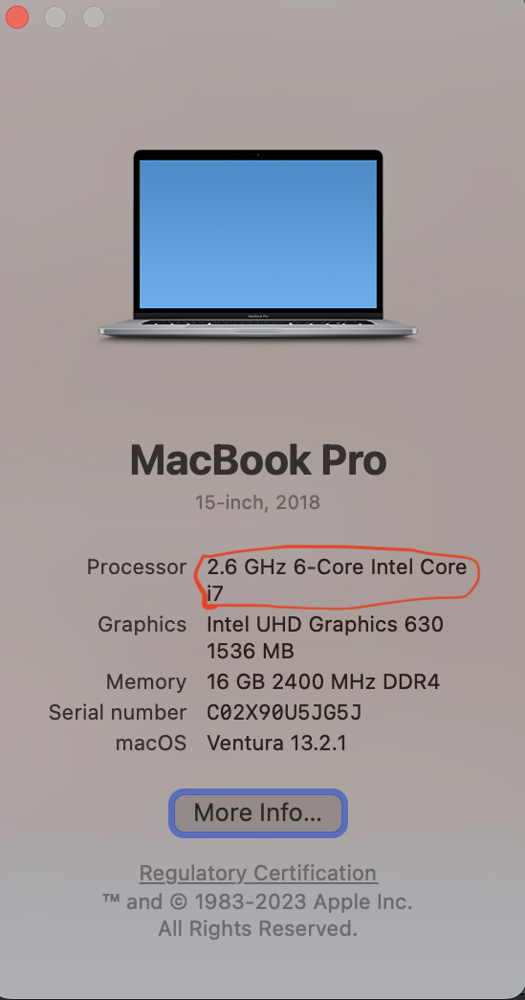
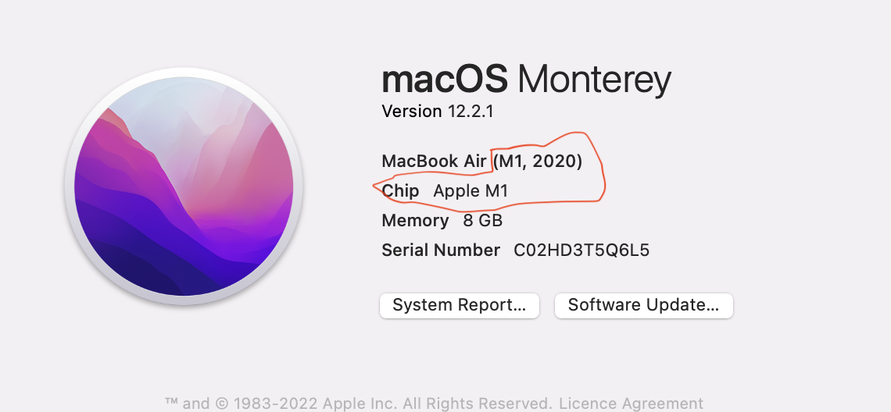
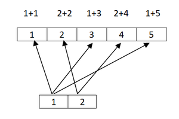
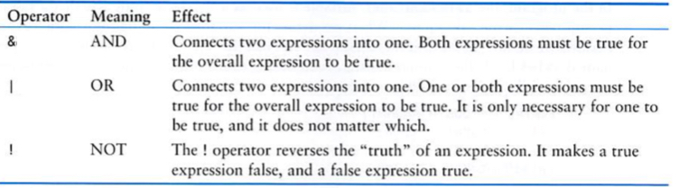

> #### Learning objectives
>
> * Install R and RStudio
> * Install the tidyverse collection of R packages
> * Introduce RStudio, which we will use to write R scripts throughout this course.
> * Introduce data types and data structures


# Installing software you will need

Before starting this course you will need to ensure that your computer is set up with the required software.

If you encounter any issues installing the software, reach out to a trainer for assistance.

# R and RStudio

**R** and **RStudio** are separate downloads and installations.

**R** is the underlying statistical computing environment. The base R system and a very large collection of packages that give you access to a huge range of statistical and analytical functionality are available from
[CRAN](https://cran.r-project.org), the Comprehensive R Archive Network.

However, using R alone is no fun. **RStudio** is a graphical integrated
development environment (IDE) that makes using R much easier and more
interactive. You need to install R before you install RStudio.

On this course we will be making use of a brilliant collection of packages designed for data science called the **`tidyverse`** that make it much easierand more fun to work with your data. After installing R and RStudio, follow the instructions at the bottom of this page to install the `tidyverse`.

## Windows

#### If you already have R and RStudio installed

* Open RStudio, and click on "Help" > "Check for updates". If a new version is
  available, quit RStudio, and download the latest version for RStudio.

To check which version of R you are using, start RStudio and the first thing
that appears in the console indicates the version of R you are running.
Alternatively, you can type `sessionInfo()`, which will also display which
version of R you are running. Go on the
[CRAN website](https://cran.r-project.org/bin/windows/base/) and check whether
a more recent version is available. If so, please download and install it. You
can [check here](https://cran.r-project.org/bin/windows/base/rw-FAQ.html#How-do-I-UNinstall-R_003f) for more information on how to remove old versions from your system if you wish to do so.

#### If you don't have R and RStudio installed

* Download R from the [CRAN website](https://cran.r-project.org/bin/windows/base/release.htm).
* Run the `.exe` file that was just downloaded
* Go to the [RStudio download page](https://posit.co/download/RStudio-desktop/#download)
* Under *Installers* select **
RStudio-2024.xx.y-zzz.EXE - Windows 10/11** (where x, y, and z represent version numbers)
* Double click the file to install it
* Once it's installed, open RStudio to make sure it works and you don't get any error messages.


## macOS

#### If you already have R and RStudio installed

* Open RStudio, and click on "Help" > "Check for updates". If a new version is available, quit RStudio, and download the latest version for RStudio.

To check the version of R you are using, start RStudio and the first thing that
appears on the terminal indicates the version of R you are running.
Alternatively, you can type `sessionInfo()`, which will also display which
version of R you are running. Go on the
[CRAN website](https://cran.r-project.org/bin/macosx/) and check whether a more
recent version is available. If so, please download and install it.

#### If you don't have R and RStudio installed

* The first thing you should do is check what chip your Mac has
* How to check chip type on Mac? Click on apple logo on top left, then chick on About This Mac.
  





* Download R from
  the [CRAN website](https://cran.r-project.org/bin/macosx/).

* Select appropriate R `.pkg` file for the latest R version
  * For M type chip: download R-x.y.z-arm64.pkg (where x, y, and z represent version numbers)
  * For inter chip: download R-x.y.z.pkg (where x, y, and z represent version numbers) 
* Double click on the downloaded file to install R
* It is also a good idea to install [XQuartz](https://www.xquartz.org/) (needed
  by some packages)
* Go to the [RStudio download page](https://posit.co/download/RStudio-desktop/#download)
* Under *Installers* select **RStudio-2024.xx.y-zzz.DMG - Mac OS 13+ (64-bit)** (where x, y, and z represent version numbers)
* Double click the file to install RStudio
* Once it's installed, open RStudio to make sure it works and you don't get any error messages.


## Linux

* Follow the instructions for your distribution
  from [CRAN](https://cloud.r-project.org/bin/linux), they provide information
  to get the most recent version of R for common distributions. For most
  distributions, you could use your package manager (e.g., for Debian/Ubuntu run
  `sudo apt-get install r-base`, and for Fedora `sudo yum install R`), but we
  don't recommend this approach as the versions provided by this are
  usually out of date. In any case, make sure you have at least R 3.3.1.
* Go to the
  [RStudio download page](https://posit.co/download/RStudio-desktop/#download)
* Under *Installers* select the version that matches your distribution, and
  install it with your preferred method (e.g., with Debian/Ubuntu `sudo dpkg -i RStudio-2024.xx.y-zzz-AMD64.DEB` at the terminal).
* Once it's installed, open RStudio to make sure it works and you don't get any error messages.


# Tidyverse

After installing R and RStudio, please install the `tidyverse` packages.

* After starting RStudio, at the console type:
  `install.packages("tidyverse")`
  (look for the 'Console' tab and type at the `>` prompt)

* You can also do this by going to Tools -> Install Packages and typing the names of the packages separated by a comma.

# Introduction to R and RStudio

# Why learn R?

* R allows you to create and use scripts, making your analysis steps transparent and easy to inspect for feedback and error-checking.

* R enhances **reproducibility**, a growing expectation among journals and funding agencies—giving you an edge in research and publishing.

* R integrates seamlessly with other tools to generate manuscripts directly from your code. This document (an R Markdown .Rmd file) is a perfect example.

* R is **interdisciplinary and extensible**, with thousands of installable packages for tasks such as image analysis, GIS, time series analysis, and population genetics.

* R scales efficiently to handle **datasets of all shapes and sizes**.

* R can connect to **spreadsheets, databases, and various data formats**, both locally and online.

* R produces **high-quality graphics** suitable for publication in journals and on the web.

* R has a **large and welcoming community**—with thousands of daily users who offer help on platforms like **Stack Overflow** and the **RStudio Community**.

* R is **free, open-source, and cross-platform**, making it accessible to everyone.

---

# RStudio  a brief tour

RStudio provides a user-friendly interface for the R statistical programming language. It consists of four main panes, which can be resized and rearranged to suit your workflow.


## Editing pane

By default, the **top-left pane** in RStudio is used for **creating, editing, and running R scripts**.


An R script is a program you write in R. A good practice is to design each script to perform a single role in your analysis workflow. As a result, you may have multiple scripts that are executed in a specific sequence to analyze your data.

A script is essentially a text file containing R commands and (ideally) comments to document its purpose and functionality.

In addition to R scripts, RStudio supports various document types, including R Markdown (.Rmd) files, which we will use in this course. These documents can generate interactive workbooks, PDFs, and web-based reports, among other formats.

## Console

The bottom-left pane in RStudio contains the console window, where output from running R scripts is displayed.


You can also use the console to test small snippets of R code. If you're accustomed to graphical interfaces like Windows or macOS, where commands are executed with a mouse click, you may find R's command-line approach different. In R, commands are typed directly into the console.

This area can also be used like a calculator. Let's just type in something like `23 + 45` followed by the return key and see what happens. You should get the following:

```
> 23 + 45
[1] 68
```

Now 68 is clearly the answer but what is that 1 in brackets?

Here is another example to explain. If we type `1:36` and press enter, what happens?
R generates output counting from 1 to 36 but cannot fit all the output on one line and so starts another like this:

```
> 1:36
 [1]  1  2  3  4  5  6  7  8  9 10 11 12 13 14 15 16 17 18 19 20 21 22 23 24 25
[26] 26 27 28 29 30 31 32 33 34 35 36
```

Now we have two lines beginning with a number in square brackets. Note that the
number of values displayed on each line may differ on your computer; it largely
depends on the width of your console pane and the font size. Try creating a
larger sequence of numbers, e.g. `1:100`, if all 36 numbers fit on a single line in your case.

This is just R helping us to keep tabs on which number we are looking at. `[1]` denotes that the line starts with the first result and the `[26]` denotes that this line starts with the 26th number. Let's try another one and generate a sequence incrementing in steps of 2:

```
> 1:36 * 2
 [1]  2  4  6  8 10 12 14 16 18 20 22 24 26 28 30 32 34 36 38 40 42 44 46 48 50
[26] 52 54 56 58 60 62 64 66 68 70 72
```

This pane also contains other tabs, but we will not be covering them in this course.

## Environment

Next, we move to the top-right pane, which contains several tabs. In this course, we will focus on two: Environment and History.


The **environment** in R keeps track of the variables you create and their contents throughout your session. It stores all the objects (such as vectors, data frames, and functions) in your workspace. You can list these objects using the `ls()` function and remove them with the `rm()` function.

**History**, on the other hand, is a log of all the R commands you've entered during your session. While it doesn’t store the objects themselves, it records the sequence of actions you’ve taken. You can view your command history with the `history()` function or by navigating through previous commands using the `Up` and `Down` arrow keys.

## Files, Plots & Help

The **bottom right-hand pane** in RStudio also contains several tabs. The **Files tab** acts as a file explorer, allowing you to navigate through your directories and select the files you want to work on. Additionally, you can change the default working directory for your R session from this pane, making it easier to manage your project files and directories.


The **Plots tab** is where any graphs you create in R will appear. You can navigate through the plots using the arrow buttons, and the **Export button** allows you to convert the plots into various graphic formats, such as for publication or use on the web.

The **Packages tab** shows the R packages currently installed, which extend R's functionality (and will be covered in more detail later). From here, you can also install new packages.

The **Help tab** is a _massively useful_ resource that lets you search the R help index. It provides access to help pages for R functions and often includes example code to assist you in using those functions effectively in your R scripts.


---


# Our first look at the R language

The overall goal of this course is to equip you with the skills to import data into R, select the most relevant subset for a given analysis, conduct an analysis to summarize the data, and create visualizations to effectively present your findings.

First though, let us consider __“What is Data?”__

Data comes in many forms: Numbers (Integers and decimal values) or alphabetical  (characters or lines of text). Clearly a computer (or R) needs a way of representing this wide range of data with it’s diverse properties.

## Data types in R


* R has 6 basic data types
  * __character__
    * character is nothing but a string
    * anything between two quotes (Single or double quotes): "a", 'cat'
    * Quoted numbers are character type: '3.14'
    
  * __numeric__ or __double__: Set of all real numbers. 
    * A number. Could be a integer or a real number: 3.14, 1.45765, 5, 1000000
  * __integer__: Whole numbers. 5L (the L tells R to store this as an integer)
  * __logical__: TRUE, FALSE
  * __complex__: 1+4i (complex numbers with real and imaginary parts)
  * __raw__: 
* The last two data types are rarely used in practice

* Different types of data are needed in (any) programming for a variety of reasons:
  * Processing instructions are different for different data types. For instance mathematical operations (+, -, x and /) are only meaningful for numbers.
  
```{r, eval=FALSE}
11 + 3 # Operation of addition performed correctly
"11" + 3 # gives error
```
  * Efficient storage: Integer type uses less memory when compared to decimal (numeric) data type.
  


### R Arithmetic Operators

Mathematical operations such as addition and multiplication are performed using various operators. Here is a list of R's arithmetic operators.
  
  * Addition: +
  * Subtraction: -
  * Multiplication: *
  * Division: /
  * Exponent: ^
  * Modulus (Remainder from division): %%

```{r}
5*5 # 5 times 5

7/3 # 7 divided by 3

7%%3 # reminder of 7 divided by 3
```


## Data structures in R


* R has many data structures. These include
  * Atomic vector
  * data frame
  * matrix
  * list
  * factors


### Atomic vector


* This is the fundamental data structure in R
* All the other data structures built on vectors 
* `Understanding this structure is absolutely essential`


```{r}
x <- 100 # create first vector
```
* "x" is an `object or a variable`, both of which are used interchangeably in this course.
* `<-` An assignment operator one can also use `=` instead of `<-`
* Meaning of above expression is x gets 100

```{r}
x <- 100 
x = 100 
```

* After a variable/object is created, it can be used as many times as needed.

```{r}
y <- 10
y*y
y + y
100 + y
```

* Variable values can be replaced

```{r}
x <- "Tom"
x
x <- "Jerry"
x
```

* variable names can not start with a number or a special characters like (_, -, etc)

```{r, eval=FALSE}
2x <- 100 # gives error
_x <- 100 # gives error
```
* only allowed special characters in variable names are "_" and "." any other special character throws an error]

```{r, eval=FALSE}
my-name <- "Chandra" # throws error
my_name <- "Chandra" # no error
my.name <- "Chandra" # no error
```

* R is case sensitive 
* COUNTRY and country are two different variables
```{r}
COUNTRY <- "United Kingdom" 
country <- "India"
```

* `c()` function should be used to create a vector that holds more than one value
* c stands for combine
* values are separated by ","
* When creating single or multiple values as a beginner, it would be advisable to use the function `c()`

```{r, eval=FALSE}
x <- 100
x <- c(100) # same like above
x <- 100, 200 # gives error
x <- c(100, 200) # no error
```

* ":" operator that generates a range of values

```{r}
x <- c(1:100) # create values from 1 to 100
```


* The values in a vector can be of one and only one type, such as numerics, integers, characters, logic, complexes, or raw data.
* When we attempt to mix different data types in a single vector, R automatically converts the data types, this phenomenon is called [Coercion](https://www.zigya.com/blog/what-is-coercion-in-r/)

```{r}
x <- c(1,2,3,4)
typeof(x)
x <- c(1,"2",3,4)
typeof(x)

y <- c(TRUE, FALSE, TRUE, 1L)
y
typeof(y)

z <- c(TRUE, FALSE, FALSE)
typeof(z)

z <- c(TRUE, FALSE, "FALSE")
z
typeof(z)
```

* Logical values TRUE and FALSE are internally represented as 1 and 0. Therefore mathematical operations can be performed on these vectors.

```{r}
y <- c(TRUE, FALSE, TRUE)
y
sum(y)
mean(y)
```


* Vectorization in R
  * It is important to note that most of R's functions are **vectorized**, which means that they operate on all elements of a vector without looping through each element one by one. Coding becomes more concise, easier to read, and less prone to errors as a result.

```{r}
x <- c(1,2,3,4,5) 
x * 5 # same as x * c(5)
x + 1 # same as x + c(1)
```

* Vectorization is powerful, quick and concise, but leads to confusion when vector lengths are different.

```{r}
x <- c(1,2,3,4,5,6)
y <- c(1,2,3,4,5,6)
x + y
```


```{r}
x <- c(1,2,3,4,5)
y <- c(1,2)
x + y
```


  
  
* How to access values from a vector?
  * Use `[]` subscript operator
  * within `[]` one can give any of the following 
    * Vector of index numbers
    * Vector of logical values


```{r}
vec <- c(10, 20, 30, 40, 50, 60, 70, 80, 90, 100)
vec
```

```{r}
# extract 4th value from the vector var
vec[4] 
vec[c(4)] # good idea to use c() function even for single value
```


```{r}
# extract 4th and 7th values from the vector var
vec[c(4,7)]
```

* One can inverse using "-" symbol

```{r}
# extract all the values except 4th and 7th value
vec[c(-4,-7)]
```

* Extracting values using logical vectors

```{r}
y <- c( 5, 8, 10) 
y[c(FALSE, TRUE, FALSE)] # extract second element
```

* Logic vectors are not created manually in reality 
* Logic vectors are the outputs of comparison operators 
* comparison operators
  * Equal to ==
  * Not equal to !=
  * Greater than >
  * Less than <
  * Greater than or equal to >=
  * Less than or equal to <=
  
  
```{r}
x <- c(10, 20, 30, 40)
x == 20
x > 20

keep <- x > 20
keep
x[keep] 
x[ x > 20 ] # The equivalent of x[keep]
```


* By using logical operators one can create complex expression for more complex subsetting
  * There are 3 logical operators in R
    * & : logical and
    * | : logical or
    * ! : logical not



* For instance if you want to extract all the values in a vector that are greater than 10 but less than 40

```{r}
x <- c(10, 20, 30, 40)
x[x > 10] # get all the values > 10
x[x < 40] # get all the values < 40
x[ x > 10 & x < 40] # get all the values > 10 and < 40
```

```{r}
x[ x == 20] # get values that are equal to 20
x[ !x == 20] # equivalent to x[ x != 20]
```

* It is possible to selectively replace vector values.

```{r}
x <- c(10, 20, 30)
x[2]
x[2] <- 1000
x
```

### Functions and their arguments

Functions are a fundamental building block of R. Functions are "canned scripts" that automate more complicated sets of commands including operations assignments, etc. Many functions are predefined, or can be made available by importing R packages (more on that later). A function usually takes one or more inputs called arguments. Functions often (but not always) return a value. A typical example would be the function `round()`. The input (the argument) must be a number, and the return value (in fact, the output) is the rounded number. Executing a function (‘running it’) is called calling the function. An example of a function call is:

```{r}
pi <- 3.141593
round(pi)
```

* `round` is a function that takes at lest one number and returns a number that rounded to the nearest integer.
* In R, all functions have the same syntax, which is function name followed by `()`
* Depends on a function within "()" you supply zero to many arguments
* The names and numbers of arguments vary from function to function
* How to know what augments function has?
  * Get help of that function
  * use `args()` function

* How to get help in R?
  * How to get help in R details: https://www.r-project.org/help.html
  * By typing `?` or `help()` followed by the name of the function in the console, for example to get help with the round function, type "?round" in the console
  * In RStudio under the help tab one can search for a given function
  * On general Google search, for instance "round + r function + documentation"

```{r}
?round 
help(round) # equivalent to ?round
```

* Use `args()` to view the arguments of a function

```{r}
args(round)
```

* Using the help or the args function, you can see that `round()` takes exactly two arguments
  * x: a numeric vector
  * digits: integer indicating the number of decimal places to round
  
```{r}
round(x=pi, digits = 0)
round(x=pi, digits = 2)
round(x=pi, digits = 4)
```

* As long as you use argument names order of the arguments does not matter.

```{r}
round( digits = 4, x=pi)
```


* Some useful math/stat functions in R
  * max(): maximum value in a numeric vector
  * min(): minimum value in a numeric vector
  * range(): vector of min and max
  * sum(): sum of a vector
  * mean(): mean of a vector
  * median(): median of a vector
  * var(): variance of a vector
  * sd(): standard deviation of a vector
  * sort(): sorted version of a vector
  * length(): length of an object
  * cor(): correlation of x and y
  
* data type conversion functions: as."datatype" family of functions are useful for converting one data type to other
  * as.numeric()
  * as.character()
  * as.integer()
  
  

### Missing data

As R was designed to analyze datasets, it includes the concept of missing data (which is uncommon in other programming languages). Missing data are represented in vectors as NA.

When doing operations on numbers, most functions will return NA if the data you are working with include missing values. This feature makes it harder to overlook the cases where you are dealing with missing data. You can add the argument na.rm = TRUE to calculate the result while ignoring the missing values.


```{r}
heights <- c(2, 4, 4, NA, 6)
mean(heights)
max(heights)
mean(heights, na.rm = TRUE)
max(heights, na.rm = TRUE)
```


If your data include missing values, you may want to become familiar with the function is.na() See below for examples.

```{r}
## Extract those elements which are not missing values.
heights[!is.na(heights)]

```

# Challenges

:::exercise
1. You have given a list of tumour volumes from 5 patients, 2.1, 1.9, 2.6, 1.8, and 3 $cm^3$. Convent this data into a R vector and get the following characteristics of data by applying some of the functions listed above.
    a. How many observations we have?
    b. What is the mean tumour volume?
    c. How many patients has tumour volume less than 2 $cm^3$?

<!-- 
<details><summary>Answer</summary>
```{r ex_1, purl=FALSE}
# Challenge 1 a: How many observations we have?
tumour_vol <- c(2.1, 1.9, 2.6, 1.8,3)
length(tumour_vol)

# Challenge 1 b:  What is the mean tumour volume?
mean(tumour_vol)

# Challenge 1 c: How many patients has tumour volume less than 2
sum(c(2.1, 1.9, 2.6, 1.8,3) < 2)
```
</details> 
-->
:::

:::exercise
2. You have given two vectors of observations data1 <- c(10, 9, 7, 6, 7, 3, 7, 5, 6, 6) and data2 <- c(5, 2, 10, 7, 2, 5, 1, 5, 3, 4).
    a. use the function `cor()` to get the correlation coefficient
    b.  Can you identify the default correlation method the `cor()` function uses? For help use `help()` or `?`
    c. Can you get Spearman correlation coefficient for these two vectors? 

<!-- 
<details><summary>Answer</summary>
```{r ex_2, purl=FALSE}
# Challenge 2 a: use the function `cor()` to get the correlation coefficient
data1 <- c(10, 9, 7, 6, 7, 3, 7, 5, 6, 6)
data2 <- c(5, 2, 10, 7, 2, 5, 1, 5, 3, 4)
cor(x=data1, y=data2)

# Challenge 2 b: Can you identify the default correlation method the `cor()` function uses?
?cor
# According to the help in the 'cor' file, if no method is specified by default the function will use the 'pearson' method.

# Challenge 2 c: Can you get Spearman correlation coefficient for these two vectors?
cor(x=data1, y=data2, method = "spearman")
```
</details>
--->
:::


:::exercise 
3. You have given a logical vector, logi_vec <- c(TRUE, FALSE, TRUE, TRUE). Can you apply math functions like `sum()`, `mean()` on this logical vector, if so what is the output of sum() and mean()?

<!-- 
<details><summary>Answer</summary>
```{r ex_3, purl=FALSE}
# Challenge 3: 
logi_vec <- c(TRUE, FALSE, TRUE, TRUE)
# Mathematical functions can be applied to logical vectors. Internally, the logical values TURE and FALSE are represented as 1 and 0, respectively.
sum(logi_vec)
mean(logi_vec)
```
</details>
--->
:::

:::exercise 
4. What is the output of following operations and explain your logic behind it.
    a. c(5, 2, 9, 1, 13) * c(2)
    b. c(5, 2, 9, 1, 13) * c(1,2)
    c. c(5, 2, 9, 1, 13) + c(1,2,3,4,5)

<!-- 
<details><summary>Answer</summary>
```{r ex_4, purl=FALSE}
# Challenge 4 a: c(5, 2, 9, 1, 13) * c(2)
c(5, 2, 9, 1, 13) * c(2)
# Since the shorter vector has only one value, every value of the longer vector is multiplied by the value of the shorter vector.

# Challenge 4 b: c(5, 2, 9, 1, 13) * c(1,2)
c(5, 2, 9, 1, 13) * c(1,2) 
# Since the shorter vector has only two values, these two values are sequentially recycled to multiply the longer vector's values.

# Challenge 4 c: c(5, 2, 9, 1, 13) + c(1,2,3,4,5)
c(5, 2, 9, 1, 13) + c(1,2,3,4,5)
# Due to the fact that both vectors have the same length, values are sequentially added together

```
</details>
--->
:::  

:::exercise
5. From the vector c(23, 12, 41, 65, 23, 6), can you extract those values that are equal to 23 or less than 15?

<!-- 
<details><summary>Answer</summary>
```{r ex_5, purl=FALSE}
vec <- c(23, 12, 41, 65, 23, 6)
vec[ vec == 23 | vec < 15]
```
</details>
--->
:::

:::exercise
6. "month.name" is a in-built R vector
    a. What is the index number of "April" in month.name vector? hist: "which" function may help you.
    b. Extract all the months from April to December

<!-- 
<details><summary>Answer</summary>
```{r ex_6, purl=FALSE}
# Challenge 6 a: What is the index number of "April" in month.name vector? hist: "which" function may help you.
which(month.name == "April")

# Challenge 6 b:Extract all the months from April to December
month.name[which(month.name == "April"):length(month.name)]

```
</details>
--->
:::

#### Credit

These instructions were adapted from [Data Carpentry](https://datacarpentry.org)
course materials.
